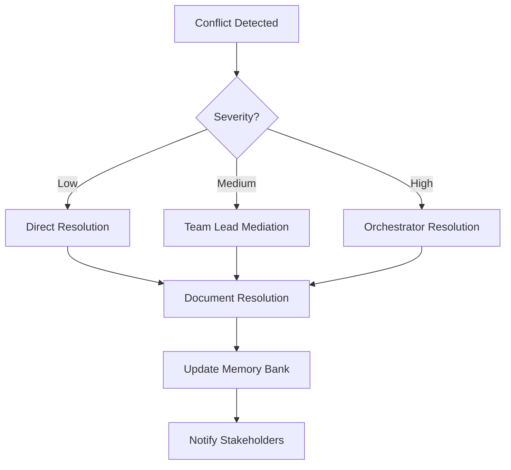
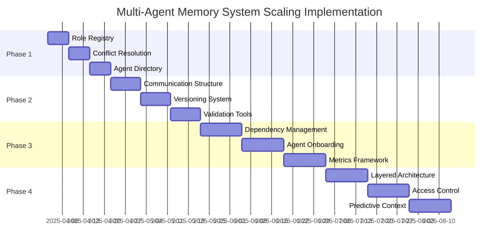

# Implementation Plan: Scaling the Multi-Agent Memory System

This document outlines a concrete implementation plan for addressing the critical scaling gaps identified in the Multi-Agent Memory System. It provides a practical roadmap for enhancing the system to support a larger number of agents in the SDLC.

## Phase 1: Foundation for Scalability (Weeks 1-2)

### 1.1 Role Registry Implementation

**Objective**: Create a formal role management system to clarify responsibilities and prevent overlap.

**Deliverables**:
- `role_registry.md` with:
  - Comprehensive role definitions
  - Primary and secondary responsibilities
  - Domain expertise areas
  - Authority boundaries

**Implementation Steps**:
1. Create role registry template
2. Define core SDLC roles (minimum 10)
3. Map existing agents to roles
4. Define role relationships and hierarchies
5. Document role evolution process

**Example Structure**:
```markdown
# Role Registry

## Role: System Architect (ID: ARCH)

### Responsibilities
- Primary: System architecture, technical decisions
- Secondary: Performance optimization, security review

### Domain Expertise
- Architecture patterns
- System integration
- Technical documentation
- Performance analysis

### Authority Boundaries
- Can approve: Architecture decisions, technology selections
- Cannot approve: UX decisions, business requirements

### Relationships
- Reports to: Chief Architect
- Supervises: Component Architects
- Collaborates with: Development Lead, UX Lead, Product Manager

### Evolution Path
- Junior Architect → System Architect → Chief Architect
```

### 1.2 Conflict Resolution Protocol

**Objective**: Establish a formal process for resolving conflicts in Memory Bank updates.

**Deliverables**:
- `conflict_resolution.md` with:
  - Conflict detection mechanisms
  - Escalation paths
  - Resolution workflows
  - Decision recording templates

**Implementation Steps**:
1. Define conflict types and severity levels
2. Create escalation matrix
3. Develop resolution workflows
4. Create decision recording templates
5. Document conflict prevention best practices

**Example Workflow**:


### 1.3 Agent Directory

**Objective**: Create a discoverable registry of all agents and their capabilities.

**Deliverables**:
- `agent_directory.md` with:
  - Agent profiles
  - Capability registry
  - Contact protocols
  - Expertise search functionality

**Implementation Steps**:
1. Create agent profile template
2. Document existing agents
3. Define capability taxonomy
4. Implement expertise tagging system
5. Create discovery protocol for new agents

**Example Agent Profile**:
```markdown
# Agent Profile: Agent 2

## Basic Information
- ID: DEV-01
- Name: Development Agent
- Role: Full Stack Developer
- Created: 2025-03-15

## Capabilities
- Frontend Development [Expert]
- Backend Development [Expert]
- Database Design [Proficient]
- API Development [Expert]
- Testing [Proficient]

## Responsibilities
- Primary owner of: progress.md, codeContext.md
- Contributor to: systemPatterns.md, techContext.md

## Contact Protocol
- Direct: @agent2
- Team: @dev-team
- Priority: [ACTION] @agent2

## Recent Activity
- Implemented Memory Bank core structure
- Created codeContext.md mapping
- Developed initialization script
```

## Phase 2: Enhanced Communication and Versioning (Weeks 3-4)

### 2.1 Hierarchical Communication Structure

**Objective**: Scale communication beyond a single flat chat file.

**Deliverables**:
- Federated communication system with:
  - Global chat (`global_chat.md`)
  - Team-based channels (`team_frontend_chat.md`, etc.)
  - Topic-based threads
  - Direct agent communication

**Implementation Steps**:
1. Define communication hierarchy
2. Create channel structure
3. Implement threading mechanism
4. Develop routing protocols
5. Create notification system

**Example Structure**:
```
.context/
├── shared/
│   ├── communication/
│   │   ├── global_chat.md
│   │   ├── teams/
│   │   │   ├── frontend_chat.md
│   │   │   ├── backend_chat.md
│   │   │   └── design_chat.md
│   │   ├── topics/
│   │   │   ├── architecture_discussion.md
│   │   │   ├── api_design.md
│   │   │   └── release_planning.md
│   │   └── direct/
│   │       ├── agent1_agent2.md
│   │       └── agent3_agent4.md
```

### 2.2 Versioning and History System

**Objective**: Implement robust versioning for Memory Bank files.

**Deliverables**:
- Version headers for all Memory Bank files
- Change logs with author attribution
- Diff visualization capability
- Rollback procedures

**Implementation Steps**:
1. Define version header format
2. Create changelog structure
3. Implement diff generation
4. Develop rollback mechanism
5. Document version control best practices

**Example Version Header**:
```markdown
---
version: 1.3.0
last_updated: 2025-03-20
updated_by: Agent 1
changelog:
  - 1.3.0 (2025-03-20): Added authentication patterns [Agent 1]
  - 1.2.0 (2025-03-15): Updated component diagram [Agent 3]
  - 1.1.0 (2025-03-10): Added initial architecture [Agent 1]
  - 1.0.0 (2025-03-05): Created document [Agent 1]
---
```

### 2.3 Automated Validation Tools

**Objective**: Develop tools to automatically validate Memory Bank consistency.

**Deliverables**:
- Validation scripts for:
  - Cross-reference checking
  - Link validation
  - Schema compliance
  - Consistency analysis

**Implementation Steps**:
1. Define validation rules
2. Create cross-reference checker
3. Implement link validator
4. Develop consistency analyzer
5. Create validation reporting system

**Example Validation Script**:
```javascript
// validate-memory-bank.js
const fs = require('fs');
const path = require('path');

// Configuration
const config = {
  memoryBankPath: '.context/shared/memory-bank',
  validationRules: {
    crossReferences: true,
    links: true,
    schemas: true,
    consistency: true
  }
};

// Validation functions
function validateCrossReferences() {
  console.log('Validating cross-references...');
  // Implementation
}

function validateLinks() {
  console.log('Validating links...');
  // Implementation
}

function validateSchemas() {
  console.log('Validating schemas...');
  // Implementation
}

function validateConsistency() {
  console.log('Validating consistency...');
  // Implementation
}

// Main validation function
function validateMemoryBank() {
  console.log('Starting Memory Bank validation...');
  
  if (config.validationRules.crossReferences) validateCrossReferences();
  if (config.validationRules.links) validateLinks();
  if (config.validationRules.schemas) validateSchemas();
  if (config.validationRules.consistency) validateConsistency();
  
  console.log('Memory Bank validation complete!');
}

// Run validation
validateMemoryBank();
```

## Phase 3: Advanced Scaling Features (Weeks 5-8)

### 3.1 Dependency Management System

**Objective**: Create a system to track and manage dependencies between agent tasks.

**Deliverables**:
- `dependency_graph.md` with visual representation of dependencies
- Automated dependency detection in action items
- Blocking notification system for dependent tasks

**Implementation Steps**:
1. Define dependency types
2. Create dependency graph visualization
3. Implement dependency tagging in action items
4. Develop blocking notification system
5. Create critical path analysis tool

### 3.2 Formalized Agent Onboarding

**Objective**: Streamline the process of adding new agents to the system.

**Deliverables**:
- `agent_onboarding.md` template
- Automated onboarding script
- Buddy system documentation
- Onboarding checklist

**Implementation Steps**:
1. Create onboarding template
2. Develop automated script
3. Define buddy system protocol
4. Create onboarding checklist
5. Document common onboarding scenarios

### 3.3 Metrics and Monitoring Framework

**Objective**: Implement ways to measure and monitor system effectiveness.

**Deliverables**:
- Metrics collection system
- Health dashboards
- Regular reporting templates
- Trend analysis tools

**Implementation Steps**:
1. Define key metrics
2. Create data collection mechanisms
3. Develop dashboard templates
4. Implement reporting system
5. Create trend analysis tools

## Phase 4: Enterprise-Scale Enhancements (Weeks 9-12)

### 4.1 Layered Memory Bank Architecture

**Objective**: Restructure the Memory Bank for better scalability.

**Deliverables**:
- Layered Memory Bank with:
  - Core Layer
  - Domain Layer
  - Implementation Layer
  - Team Layer

**Implementation Steps**:
1. Define layer boundaries
2. Create migration plan
3. Update cross-references
4. Implement layer-specific access controls
5. Document new architecture

### 4.2 Role-Based Access Control

**Objective**: Implement formal access controls for Memory Bank resources.

**Deliverables**:
- Access control definitions
- Permission matrix
- Role-based file ownership
- Access request workflow

**Implementation Steps**:
1. Define permission types
2. Create role-permission matrix
3. Implement file ownership system
4. Develop access request workflow
5. Document access control policies

### 4.3 Predictive Context Management

**Objective**: Develop advanced features to predict context needs.

**Deliverables**:
- Context prediction algorithms
- Proactive context loading
- Context relevance scoring
- Personalized context views

**Implementation Steps**:
1. Define prediction models
2. Implement relevance scoring
3. Create proactive loading mechanism
4. Develop personalized views
5. Document prediction algorithms

## Implementation Timeline



## Success Metrics

To evaluate the effectiveness of these enhancements, we will track the following metrics:

1. **Scalability Metrics**
   - Number of active agents
   - Memory Bank size and complexity
   - Communication volume
   - Dependency network size

2. **Efficiency Metrics**
   - Context reset recovery time
   - Time to onboard new agents
   - Conflict resolution time
   - Task completion time

3. **Quality Metrics**
   - Memory Bank consistency score
   - Cross-reference accuracy
   - Documentation completeness
   - Context alignment

4. **Collaboration Metrics**
   - Inter-agent communication frequency
   - Dependency resolution efficiency
   - Role boundary clarity
   - Decision-making time

## Conclusion

This implementation plan provides a structured approach to addressing the scaling gaps in the Multi-Agent Memory System. By following this roadmap, the system will evolve to support a larger number of agents while maintaining its effectiveness in preserving context and enabling collaboration.

The phased approach allows for incremental improvements, with each phase building on the foundation established by previous phases. The most critical enhancements (Role Registry, Conflict Resolution, and Agent Directory) are prioritized in Phase 1 to provide immediate benefits and establish the groundwork for more advanced features.

With these enhancements, the Multi-Agent Memory System will be well-positioned to support enterprise-scale software development projects with numerous specialized agents working collaboratively across the entire SDLC.
