# System Architecture Documentation

## 1. System Overview

### 1.1 System Context
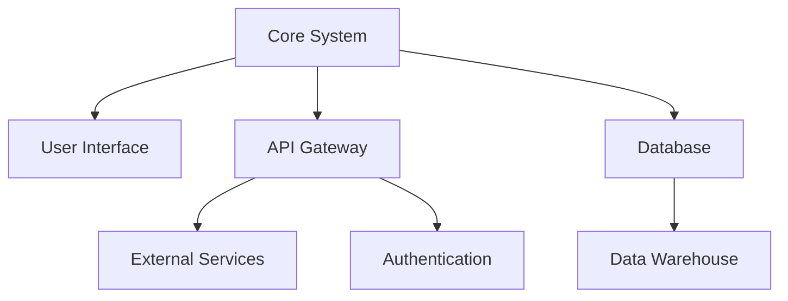

### 1.2 Component Architecture
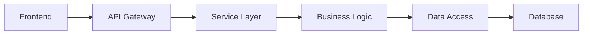

## 2. Data Architecture

### 2.1 Entity Relationship Diagram
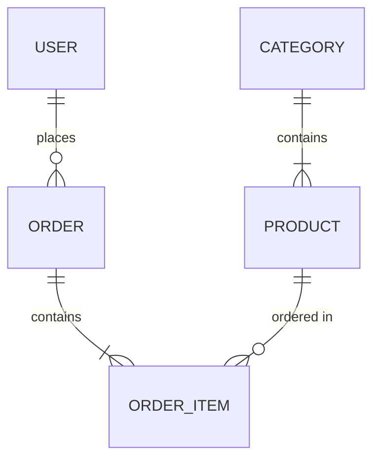

### 2.2 Database Schema
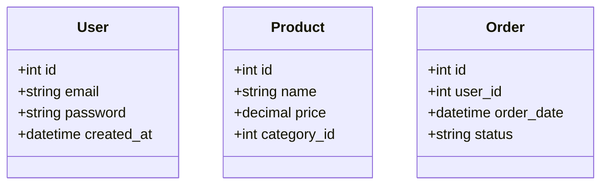

## 3. Process Architecture

### 3.1 Authentication Flow
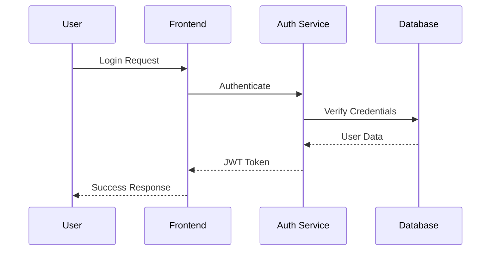

### 3.2 Order Processing
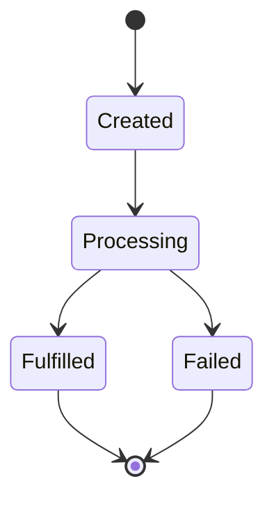

## 4. User Interaction

### 4.1 Use Cases
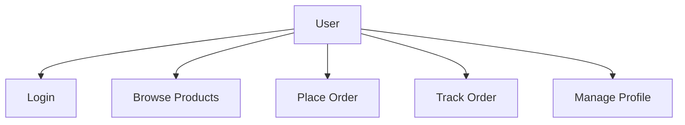

### 4.2 User Flow
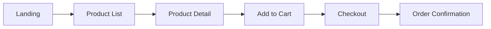

## 5. Deployment Architecture

### 5.1 Infrastructure
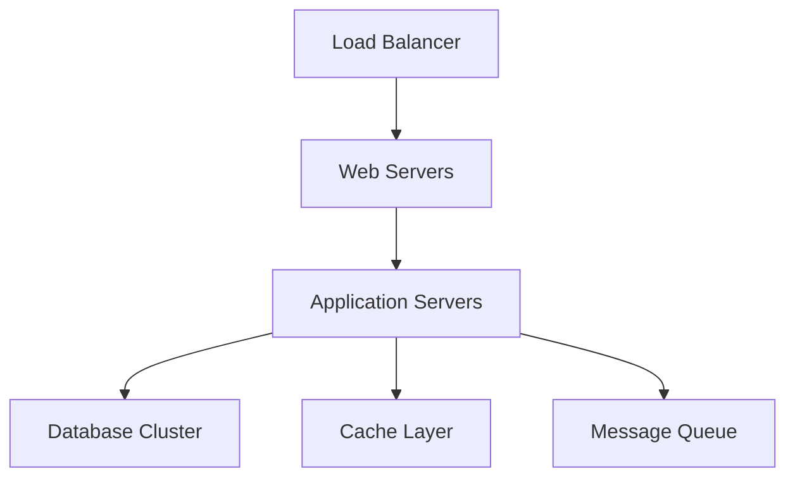

### 5.2 Network Layout
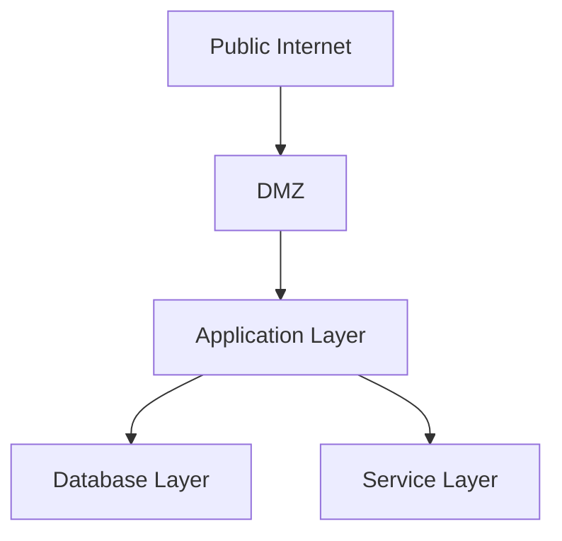

## 6. Security Architecture

### 6.1 Authentication Flow
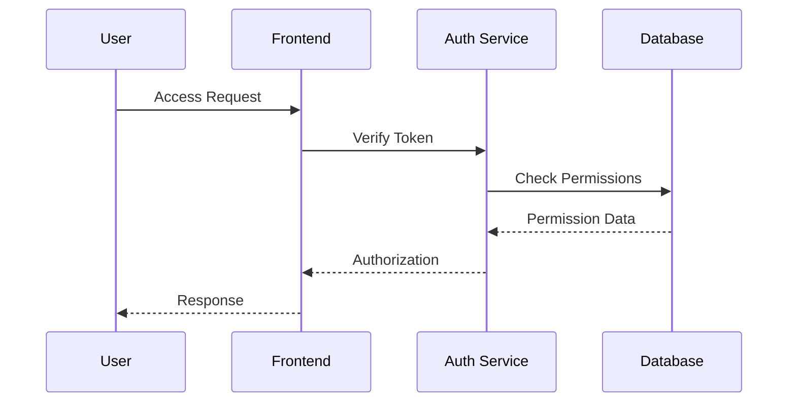

### 6.2 Data Protection
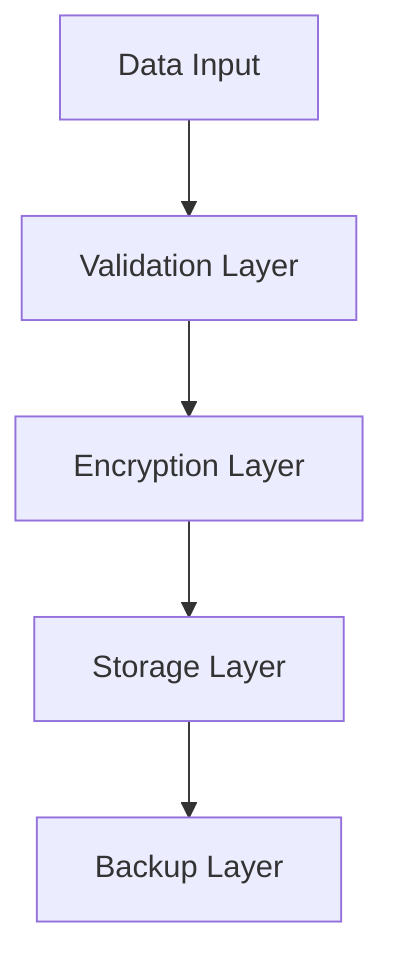

## 7. Integration Architecture

### 7.1 Service Integration
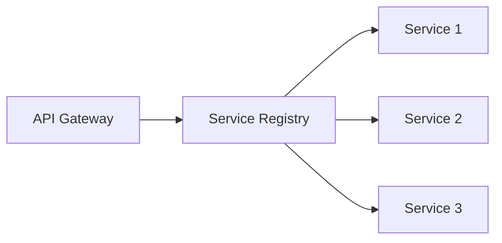

### 7.2 Event Flow
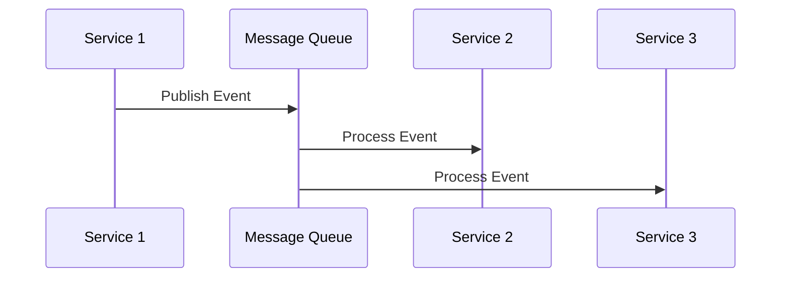