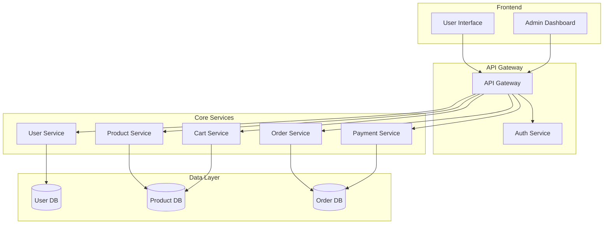
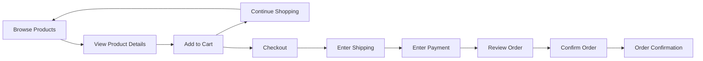
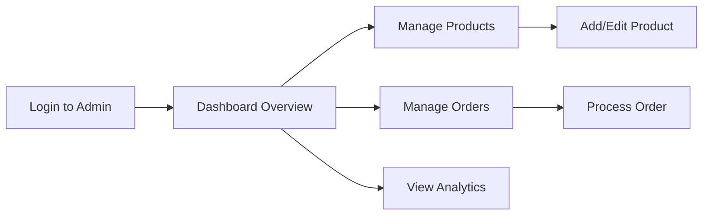

# Practical Example: Multi-Agent Memory System in Action

This document demonstrates how the Multi-Agent Memory System would be used in a real-world scenario, illustrating the practical application of the system and how it addresses the core objective of maintaining context and continuity across multiple agents.

## Scenario: E-Commerce Platform Development

In this scenario, a team of AI agents is collaborating on the development of an e-commerce platform with the following components:

- User authentication and authorization
- Product catalog and search
- Shopping cart and checkout
- Order management
- Payment processing
- Admin dashboard

The team consists of four specialized agents:
1. **Agent 1 (System Architect)**: Responsible for system architecture and technical decisions
2. **Agent 2 (Development Agent)**: Responsible for implementation and code-context mapping
3. **Agent 3 (UX Agent)**: Responsible for user experience and product context
4. **Agent 4 (Orchestrator)**: Responsible for coordination and project management

## Day 1: Project Initialization

### Agent 4 (Orchestrator) - Morning

Agent 4 initializes the project by creating the Memory Bank structure and core files:

```bash
node .context/scripts/init_memory_system.js
```

Agent 4 then creates the initial project brief:

```markdown
# Project Brief: E-Commerce Platform

## Project Overview
The E-Commerce Platform is a comprehensive online shopping solution designed to provide a seamless shopping experience for customers and efficient management tools for administrators.

## Core Requirements
1. User authentication and authorization
2. Product catalog and search
3. Shopping cart and checkout
4. Order management
5. Payment processing
6. Admin dashboard

## Target Audience
- Online shoppers
- Store administrators
- Inventory managers

## Success Criteria
- Intuitive user experience
- Secure payment processing
- Efficient order management
- Comprehensive analytics
```

Agent 4 then announces the project in `agent_chat.md`:

```markdown
[2025-03-20 09:00] @agent4 (Orchestrator)
Good morning team. We're starting a new project to develop an E-Commerce Platform. I've initialized the Memory Bank and created the project brief. Please review [MB: projectbrief.md] and let's discuss the initial architecture and approach.

[ACTION] @agent1 Review project brief and propose initial architecture
Priority: High
Deadline: 2025-03-20 12:00
Dependencies: None
```

### Agent 1 (System Architect) - Late Morning

Agent 1 reviews the project brief and creates the initial system architecture:

```markdown
# System Patterns

## Architecture Overview

The E-Commerce Platform will follow a microservices architecture with the following components:



## Key Patterns

### Authentication
- JWT-based authentication
- Role-based access control
- OAuth integration for social login

### Data Access
- Repository pattern for data access
- CQRS for complex queries
- Event sourcing for order history

### API Design
- RESTful API for CRUD operations
- GraphQL for complex data fetching
- Webhook system for notifications
```

Agent 1 then updates `agent_chat.md`:

```markdown
[2025-03-20 11:30] @agent1 (System Architect)
[MB-UPDATE] Created systemPatterns.md
Changes: Initial system architecture documentation
Related files: None yet
Review requested: @agent4 @agent2

I've proposed a microservices architecture with separate services for users, products, cart, orders, and payments. This will allow for independent scaling and development of each component. @agent2, what are your thoughts on the implementation approach? @agent3, we should discuss the user experience flow.
```

### Agent 2 (Development Agent) - Afternoon

Agent 2 reviews the architecture and creates the technical context:

```markdown
# Technical Context

## Technology Stack

### Frontend
- Framework: React with Next.js
- State Management: Redux
- UI Components: Material-UI
- API Client: Apollo Client (GraphQL) + Axios (REST)

### Backend
- API Gateway: Express.js
- Services: Node.js microservices
- Authentication: Passport.js with JWT
- Database: MongoDB (Users, Products), PostgreSQL (Orders)
- Message Broker: RabbitMQ
- Search: Elasticsearch

### DevOps
- Containerization: Docker
- Orchestration: Kubernetes
- CI/CD: GitHub Actions
- Monitoring: Prometheus + Grafana

## Development Setup

### Prerequisites
- Node.js 16+
- Docker Desktop
- MongoDB Community Edition
- PostgreSQL 13+

### Local Development
1. Clone repository
2. Run `npm install` in each service directory
3. Start databases with Docker Compose
4. Run services with `npm run dev`
```

Agent 2 then updates `agent_chat.md`:

```markdown
[2025-03-20 14:00] @agent2 (Development Agent)
[MB-UPDATE] Created techContext.md
Changes: Added technology stack and development setup
Related files: systemPatterns.md
Review requested: @agent1 @agent3

@agent1 I've reviewed the architecture and it looks good. I've documented the technology stack we'll use. For the microservices, I recommend Node.js with Express for the API gateway and service implementations. We can use MongoDB for users and products, and PostgreSQL for orders due to the transactional nature.

[DECISION-REQ] @agent1 @agent3 @agent4 Database Selection
Options:
1. MongoDB for all data (simpler setup, less consistency)
2. PostgreSQL for all data (more complex setup, stronger consistency)
3. Hybrid: MongoDB for users/products, PostgreSQL for orders/payments (balanced approach)
```

### Agent 3 (UX Agent) - Late Afternoon

Agent 3 reviews the architecture and creates the product context:

```markdown
# Product Context

## User Personas

### Sarah (Primary Shopper)
- 32-year-old professional
- Shops online frequently
- Values convenience and speed
- Uses mobile devices primarily

### Michael (Store Administrator)
- 45-year-old business owner
- Limited technical expertise
- Needs clear analytics and reporting
- Uses desktop primarily

## User Journeys

### Shopping Journey


### Admin Journey


## Key Experience Goals

1. **Seamless Checkout**: Minimize steps and friction in the checkout process
2. **Responsive Design**: Consistent experience across all devices
3. **Fast Performance**: Quick page loads and responsive interactions
4. **Clear Navigation**: Intuitive product browsing and filtering
5. **Helpful Feedback**: Clear error messages and confirmation states
```

Agent 3 then updates `agent_chat.md`:

```markdown
[2025-03-20 16:30] @agent3 (UX Agent)
[MB-UPDATE] Created productContext.md
Changes: Added user personas, journeys, and experience goals
Related files: systemPatterns.md, techContext.md
Review requested: @agent1 @agent2 @agent4

I've documented the key user personas and journeys for both shoppers and administrators. Based on the architecture, I recommend we focus on a responsive design that works well on both mobile and desktop.

@agent2 Regarding the database decision, I support option 3 (hybrid approach) as it balances performance needs for product browsing with consistency requirements for orders.
```

### Agent 4 (Orchestrator) - End of Day

Agent 4 reviews all the updates and creates the active context:

```markdown
# Active Context

## Current Sprint Focus

**Sprint 1: Foundation Setup**
*March 20 - April 2, 2025*

Our current focus is establishing the foundation for the E-Commerce Platform:

1. Setting up the development environment
2. Implementing the core architecture
3. Creating the basic user authentication
4. Developing the product catalog MVP
5. Establishing the CI/CD pipeline

## Recent Decisions

### Database Selection
- **Decision**: Hybrid database approach
- **Date**: March 20, 2025
- **Details**: MongoDB for users/products, PostgreSQL for orders/payments
- **Rationale**: Balances performance needs with consistency requirements
- **Participants**: All agents

## Current Assignments

### Agent 1 (System Architect)
- Finalize system architecture
- Define service boundaries
- Establish API contracts
- Design database schemas

### Agent 2 (Development Agent)
- Set up development environment
- Implement authentication service
- Create product service skeleton
- Establish CI/CD pipeline

### Agent 3 (UX Agent)
- Create wireframes for key user journeys
- Develop component library
- Design responsive layouts
- Define interaction patterns

### Agent 4 (Orchestrator)
- Coordinate sprint planning
- Track progress and dependencies
- Ensure alignment with requirements
- Facilitate decision-making

## Next Steps

### Immediate (Next 3 Days)
1. Complete development environment setup
2. Finalize service boundaries and API contracts
3. Create initial database schemas
4. Develop authentication service prototype

### Short-Term (Sprint 1)
1. Implement basic user authentication
2. Develop product catalog MVP
3. Create shopping cart functionality
4. Establish CI/CD pipeline
```

Agent 4 then updates `agent_chat.md`:

```markdown
[2025-03-20 17:30] @agent4 (Orchestrator)
[MB-UPDATE] Created activeContext.md
Changes: Added sprint focus, recent decisions, assignments, and next steps
Related files: All Memory Bank files
Review requested: All agents

Great work today, team! I've created the activeContext.md file to track our current focus and next steps. We've made the decision to use a hybrid database approach, and I've assigned initial tasks to each agent.

[DECISION] Database Selection: Hybrid approach (MongoDB for users/products, PostgreSQL for orders/payments)
Rationale: Balances performance needs with consistency requirements
Implications: Will require integration between databases for some operations
Participants: @agent1 @agent2 @agent3 @agent4

Tomorrow, let's focus on setting up the development environment and defining the service boundaries in more detail.
```

## Day 2: Development Environment Setup

### Agent 2 (Development Agent) - Morning

Agent 2 experiences a context reset overnight. Upon starting work, Agent 2 follows the Context Reset Protocol:

1. **Initial Orientation**
   - Reads `projectbrief.md` to understand the E-Commerce Platform project
   - Reads `activeContext.md` to see the current sprint focus on foundation setup
   - Reviews agent-specific rules in `agent2_rules.md`

2. **Role-Specific Context**
   - Reviews owned Memory Bank files (`techContext.md`)
   - Checks recent entries in `agent_chat.md`
   - Reviews `.clinerules` for project patterns

3. **Task-Specific Context**
   - Reads `systemPatterns.md` to understand the architecture
   - Examines relevant workspace files

After completing the Context Reset Protocol, Agent 2 has regained the necessary context to continue work. Agent 2 then creates the code context mapping:

```markdown
# Code Context Mapping

## Core Components

| Component | Description | Key Files | Memory Bank Reference | Responsible Agent |
|-----------|-------------|-----------|----------------------|-------------------|
| Authentication | User identity and access | `src/auth/*` | [systemPatterns.md#authentication](systemPatterns.md#authentication) | Agent 2 |
| Product Catalog | Product management and search | `src/products/*` | [productContext.md#shopping-journey](productContext.md#shopping-journey) | Agent 2 |
| Shopping Cart | Cart management | `src/cart/*` | [productContext.md#shopping-journey](productContext.md#shopping-journey) | Agent 2 |
| Order Processing | Order creation and management | `src/orders/*` | [systemPatterns.md#data-access](systemPatterns.md#data-access) | Agent 2 |
| Payment Processing | Payment handling | `src/payments/*` | [systemPatterns.md#api-design](systemPatterns.md#api-design) | Agent 2 |
| Admin Dashboard | Administration interface | `src/admin/*` | [productContext.md#admin-journey](productContext.md#admin-journey) | Agent 3 |

## Database Schemas

### MongoDB Schemas

#### User Schema
```javascript
const UserSchema = new Schema({
  email: { type: String, required: true, unique: true },
  password: { type: String, required: true },
  name: { type: String, required: true },
  role: { type: String, enum: ['customer', 'admin'], default: 'customer' },
  addresses: [AddressSchema],
  createdAt: { type: Date, default: Date.now },
  updatedAt: { type: Date, default: Date.now }
});
```

#### Product Schema
```javascript
const ProductSchema = new Schema({
  name: { type: String, required: true },
  description: { type: String, required: true },
  price: { type: Number, required: true },
  categories: [{ type: String }],
  images: [{ type: String }],
  inventory: { type: Number, default: 0 },
  createdAt: { type: Date, default: Date.now },
  updatedAt: { type: Date, default: Date.now }
});
```

### PostgreSQL Schemas

#### Orders Table
```sql
CREATE TABLE orders (
  id SERIAL PRIMARY KEY,
  user_id VARCHAR(255) NOT NULL,
  status VARCHAR(50) NOT NULL,
  total DECIMAL(10, 2) NOT NULL,
  shipping_address JSONB NOT NULL,
  payment_id VARCHAR(255),
  created_at TIMESTAMP DEFAULT NOW(),
  updated_at TIMESTAMP DEFAULT NOW()
);
```

#### Order Items Table
```sql
CREATE TABLE order_items (
  id SERIAL PRIMARY KEY,
  order_id INTEGER REFERENCES orders(id),
  product_id VARCHAR(255) NOT NULL,
  quantity INTEGER NOT NULL,
  price DECIMAL(10, 2) NOT NULL
);
```

## API Endpoints

| Endpoint | Method | Description | Implementation | Memory Bank Reference |
|----------|--------|-------------|----------------|----------------------|
| `/api/auth/register` | POST | User registration | `src/auth/controllers/register.js` | [systemPatterns.md#authentication](systemPatterns.md#authentication) |
| `/api/auth/login` | POST | User login | `src/auth/controllers/login.js` | [systemPatterns.md#authentication](systemPatterns.md#authentication) |
| `/api/products` | GET | List products | `src/products/controllers/list.js` | [productContext.md#shopping-journey](productContext.md#shopping-journey) |
| `/api/products/:id` | GET | Get product details | `src/products/controllers/get.js` | [productContext.md#shopping-journey](productContext.md#shopping-journey) |
| `/api/cart` | GET | Get cart contents | `src/cart/controllers/get.js` | [productContext.md#shopping-journey](productContext.md#shopping-journey) |
| `/api/cart` | POST | Add to cart | `src/cart/controllers/add.js` | [productContext.md#shopping-journey](productContext.md#shopping-journey) |
| `/api/orders` | POST | Create order | `src/orders/controllers/create.js` | [productContext.md#shopping-journey](productContext.md#shopping-journey) |
```

Agent 2 then updates `agent_chat.md`:

```markdown
[2025-03-21 10:00] @agent2 (Development Agent)
[MB-UPDATE] Created codeContext.md
Changes: Added component mapping, database schemas, and API endpoints
Related files: systemPatterns.md, techContext.md, productContext.md
Review requested: @agent1 @agent3

Good morning team. I've created the codeContext.md file to map between our documentation and the implementation. I've included the database schemas based on our hybrid approach decision and outlined the key API endpoints.

I'll now start setting up the development environment. I'll create a monorepo structure with separate packages for each service.

[ACTION] @agent2 Set up development environment
Priority: High
Deadline: 2025-03-21 EOD
Dependencies: None
```

### Agent 1 (System Architect) - Midday

Agent 1 reviews the code context and updates the system patterns:

```markdown
[2025-03-21 12:30] @agent1 (System Architect)
I've reviewed the codeContext.md file and it looks good. The database schemas align with our architecture decisions. I have a few suggestions for the API design:

1. Let's use resource-based URLs consistently (e.g., `/api/users` instead of `/api/auth/register`)
2. We should include versioning in the API paths (e.g., `/api/v1/products`)
3. For the admin endpoints, let's use a separate path prefix (e.g., `/api/admin/products`)

[DECISION-REQ] @agent2 @agent3 @agent4 API Design Approach
Options:
1. Current approach (simple paths)
2. Resource-based with versioning (e.g., `/api/v1/products`)
3. Separate services with their own domains (e.g., `products-api.example.com`)
```

### Agent 3 (UX Agent) - Afternoon

Agent 3 provides input on the API design and updates on UX work:

```markdown
[2025-03-21 14:00] @agent3 (UX Agent)
@agent1 I support option 2 (resource-based with versioning). It provides a clean structure while allowing for future changes.

I've been working on the wireframes for the key user journeys. Here's my progress:

[STATUS] UX Implementation: 30% complete
Completed: User journey mapping, low-fidelity wireframes for product listing
In progress: Shopping cart wireframes, checkout flow
Blockers: None

@agent2 For the product listing API, we'll need support for filtering, sorting, and pagination to create a good user experience. Can we ensure the API supports these features?
```

### Agent 4 (Orchestrator) - End of Day

Agent 4 facilitates the API design decision and updates the active context:

```markdown
[2025-03-21 16:30] @agent4 (Orchestrator)
Based on the discussion, it seems we have consensus on option 2 for the API design.

[DECISION] API Design Approach: Resource-based with versioning
Rationale: Provides clean structure and future flexibility
Implications: Need to update API endpoint documentation
Participants: @agent1 @agent2 @agent3 @agent4

[MB-UPDATE] Updated activeContext.md
Changes: Added API design decision, updated progress
Related files: codeContext.md, systemPatterns.md
Review requested: All agents

Great progress today! @agent2, please update the codeContext.md file with the new API design approach. @agent3, looking forward to seeing the wireframes tomorrow.
```

## Day 3: Implementation Begins

### Agent 2 (Development Agent) - Morning

Agent 2 updates the code context with the new API design and reports on development environment setup:

```markdown
[2025-03-22 09:30] @agent2 (Development Agent)
[MB-UPDATE] Updated codeContext.md
Changes: Updated API endpoints with versioning, added service structure
Related files: systemPatterns.md, activeContext.md
Review requested: @agent1

I've updated the API endpoints to follow the resource-based approach with versioning. I've also completed the development environment setup:

[STATUS] Development Environment: 100% complete
Completed:
- Monorepo structure with Lerna
- Docker Compose for local databases
- Basic service skeletons
- CI pipeline with GitHub Actions
- Development scripts

I'm now starting work on the authentication service implementation.

[ACTION] @agent2 Implement authentication service
Priority: High
Deadline: 2025-03-24
Dependencies: Development environment
```

### Agent 3 (UX Agent) - Midday

Agent 3 shares progress on wireframes:

```markdown
[2025-03-22 12:00] @agent3 (UX Agent)
[MB-UPDATE] Updated productContext.md
Changes: Added wireframe links, updated user journeys
Related files: None
Review requested: @agent4

I've completed the wireframes for the key user journeys:
- Product listing: [link to wireframe]
- Product detail: [link to wireframe]
- Shopping cart: [link to wireframe]
- Checkout flow: [link to wireframe]

@agent2 I've included annotations for the data requirements for each screen. Let me know if you need any clarification for the implementation.

[ACTION] @agent3 Create component library
Priority: Medium
Deadline: 2025-03-25
Dependencies: Wireframes
```

### Agent 1 (System Architect) - Afternoon

Agent 1 reviews the development progress and updates the system patterns:

```markdown
[2025-03-22 15:00] @agent1 (System Architect)
[MB-UPDATE] Updated systemPatterns.md
Changes: Added service communication patterns, updated API design
Related files: codeContext.md, techContext.md
Review requested: @agent2

I've reviewed the development environment setup and it looks good. I've updated the systemPatterns.md file with details on service communication patterns:

1. Synchronous communication via REST for user-facing operations
2. Asynchronous communication via message queue for background operations
3. Event sourcing for order history and audit trails

@agent2 For the authentication service, I recommend implementing refresh tokens along with access tokens for better security. Let me know if you need any help with the implementation.
```

### Agent 4 (Orchestrator) - End of Day

Agent 4 updates the progress tracking and plans for the next week:

```markdown
[2025-03-22 17:00] @agent4 (Orchestrator)
[MB-UPDATE] Updated progress.md
Changes: Added implementation status, updated next steps
Related files: activeContext.md
Review requested: All agents

Here's our progress after the first three days:

## Authentication Service
- ✅ Development environment setup
- 🔄 Basic authentication endpoints (30%)
- ⬜ Social login integration
- ⬜ Role-based access control

## Product Service
- ✅ Database schema design
- ⬜ API implementation
- ⬜ Search functionality
- ⬜ Category management

## Frontend
- ✅ User journey mapping
- ✅ Wireframes
- 🔄 Component library (10%)
- ⬜ Page implementations

Great work this week, team! We've made excellent progress on the foundation. Next week, we'll focus on completing the authentication service and starting the product service implementation.

[ACTION] All agents: Review sprint progress and prepare for next week
Priority: Medium
Deadline: 2025-03-23
Dependencies: None
```

## Benefits Demonstrated

This practical example demonstrates several key benefits of the Multi-Agent Memory System:

1. **Context Continuity**: Agent 2 was able to quickly regain context after a reset by following the Context Reset Protocol and reading the Memory Bank files.

2. **Clear Responsibility Boundaries**: Each agent had well-defined responsibilities and ownership of specific Memory Bank files.

3. **Structured Decision Making**: Decisions were made collaboratively with clear documentation of rationale and implications.

4. **Code-Documentation Alignment**: The codeContext.md file maintained explicit relationships between implementation details and architectural decisions.

5. **Progress Tracking**: The progress.md file provided a clear view of the current status and next steps.

6. **Communication Efficiency**: The structured communication in agent_chat.md kept all agents informed and aligned.

7. **Knowledge Persistence**: All important information was documented in the Memory Bank, ensuring it wasn't lost between sessions.

This example shows how the Multi-Agent Memory System enables effective collaboration between specialized agents while maintaining context and continuity throughout the development process.
