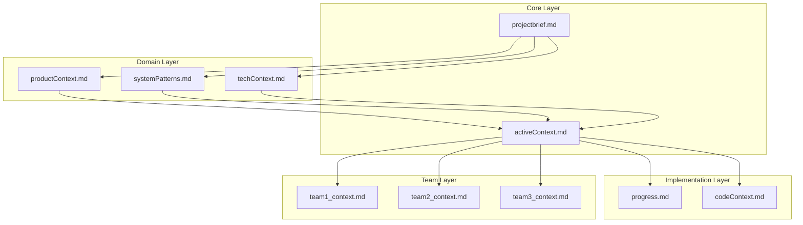
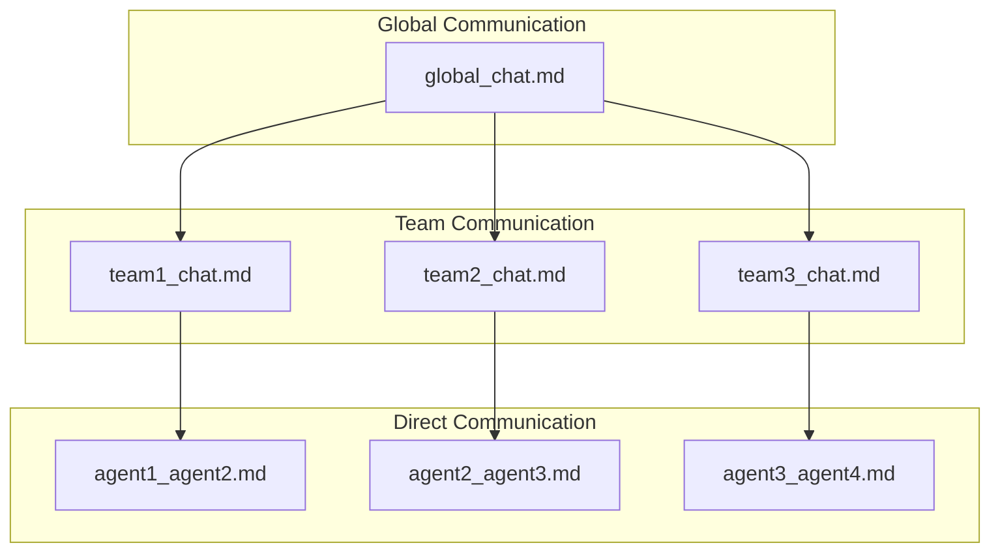
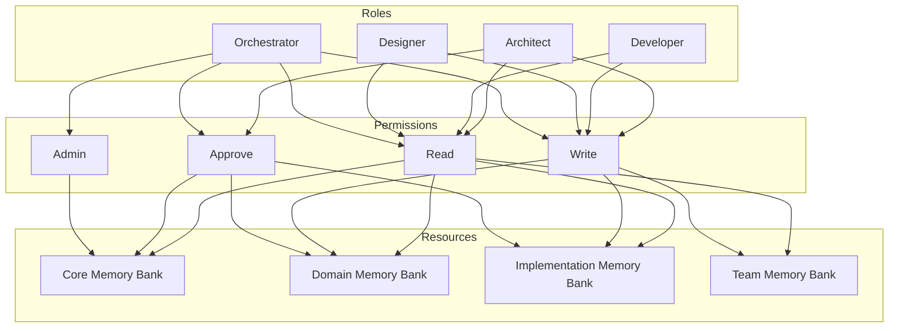

# Scaling Gaps Analysis: Multi-Agent Memory System

This document identifies gaps in the current Multi-Agent Memory System implementation that could limit scalability when adding more agents to the project SDLC, along with proposed solutions.

## Core Objective Review

The core objective of the Multi-Agent Memory System is to maintain context and continuity across multiple AI agents collaborating on software development projects. While the current implementation provides a solid foundation, several gaps emerge when considering scaling to a larger number of agents.

## Identified Gaps and Solutions

### 1. Agent Onboarding Process

**Gap**: The current system lacks a formalized process for onboarding new agents. As more agents join the project, manual onboarding becomes inefficient and error-prone.

**Solution**:
- Create an `agent_onboarding.md` template in the templates directory
- Develop an automated onboarding script that:
  - Creates agent-specific workspace
  - Generates role-specific rules
  - Assigns Memory Bank file ownership
  - Introduces the agent in agent_chat.md
- Implement a "buddy system" where existing agents help onboard new agents

### 2. Role Overlap Management

**Gap**: As more agents are added, role overlap becomes inevitable, leading to potential confusion about responsibilities and ownership.

**Solution**:
- Create a formal Role Registry (`role_registry.md`) that defines:
  - Primary and secondary responsibilities for each role
  - Clear boundaries between roles
  - Escalation paths for boundary disputes
- Implement a RACI matrix (Responsible, Accountable, Consulted, Informed) for Memory Bank files
- Establish a role governance process led by the Orchestrator agent

### 3. Communication Scaling

**Gap**: The current flat communication structure in `agent_chat.md` will become unwieldy with many agents, making it difficult to track relevant conversations.

**Solution**:
- Implement a hierarchical communication structure:
  - Team-based channels (e.g., frontend, backend, design)
  - Topic-based threads
  - Direct agent-to-agent communication
- Create a communication router that directs messages to relevant agents
- Implement notification filters to prevent information overload
- Add summarization protocols for lengthy discussions

### 4. Dependency Management

**Gap**: With more agents, task dependencies become more complex and difficult to track manually.

**Solution**:
- Create a formal dependency tracking system:
  - `dependency_graph.md` file that visualizes dependencies
  - Automated dependency detection in action items
  - Blocking notification system for dependent tasks
- Implement a critical path analysis for complex task networks
- Create a dependency resolution protocol for blocked tasks

### 5. Conflict Resolution

**Gap**: More agents means higher likelihood of conflicts in Memory Bank updates, with no formal resolution process.

**Solution**:
- Establish a formal conflict resolution protocol:
  - Detection of conflicting updates
  - Escalation path to responsible agents
  - Mediation process led by Orchestrator
  - Decision recording with rationale
- Implement a "conflict prevention" system with pre-update notifications
- Create conflict resolution templates for common scenarios

### 6. Versioning and History

**Gap**: The current system lacks robust versioning for Memory Bank files, which becomes critical with more agents making updates.

**Solution**:
- Implement a formal versioning system:
  - Version headers in all Memory Bank files
  - Change logs with author attribution
  - Diff visualization for significant changes
  - Rollback procedures for problematic updates
- Integrate with version control systems (Git)
- Create temporal queries to view Memory Bank state at specific points in time

### 7. Agent Discovery

**Gap**: New agents have no systematic way to discover existing agents and their capabilities.

**Solution**:
- Create an Agent Directory:
  - `agent_directory.md` with agent profiles
  - Capability registry with expertise areas
  - Contact protocols for different scenarios
- Implement a discovery protocol for new agents
- Create agent capability advertisements in agent_chat.md
- Develop expertise search functionality

### 8. Workspace Isolation

**Gap**: As more agents are added, workspace boundaries may blur, leading to interference.

**Solution**:
- Enhance workspace isolation:
  - Formal access control policies
  - Workspace boundary definitions
  - Cross-workspace collaboration protocols
  - Shared resource management
- Implement workspace request protocols
- Create workspace synchronization mechanisms for collaborative work

### 9. Automated Validation

**Gap**: With more agents, manual validation of Memory Bank consistency becomes impractical.

**Solution**:
- Develop automated validation tools:
  - Cross-reference checkers
  - Link validators
  - Consistency analyzers
  - Schema validators for structured content
- Implement pre-commit hooks for validation
- Create regular validation reports
- Develop self-healing mechanisms for common issues

### 10. Metrics and Monitoring

**Gap**: The system lacks ways to monitor its effectiveness as it scales.

**Solution**:
- Implement a metrics and monitoring framework:
  - Context quality metrics
  - Communication efficiency metrics
  - Memory Bank health indicators
  - Agent performance dashboards
- Create regular system health reports
  - Memory Bank usage statistics
  - Communication pattern analysis
  - Context reset success rates
- Develop trend analysis for system optimization

## Implementation Priorities

To address these gaps effectively, we recommend the following implementation priorities:

1. **Immediate (High Impact/Low Effort)**
   - Role Registry implementation
   - Conflict Resolution Protocol
   - Agent Directory

2. **Short-term (High Impact/Medium Effort)**
   - Versioning and History system
   - Communication Scaling enhancements
   - Automated Validation tools

3. **Medium-term (Medium Impact/Medium Effort)**
   - Dependency Management system
   - Agent Onboarding Process
   - Metrics and Monitoring framework

4. **Long-term (Medium Impact/High Effort)**
   - Workspace Isolation enhancements
   - Advanced Communication Routing
   - Predictive Context Management

## Architectural Enhancements

To support these scaling solutions, the following architectural enhancements are recommended:

### 1. Layered Memory Bank

### 2. Federated Communication Model

### 3. Role-Based Access Control

## Conclusion

The current Multi-Agent Memory System provides a solid foundation but requires these enhancements to scale effectively with additional agents. By implementing these solutions, the system will maintain its effectiveness in preserving context and enabling collaboration, even as the number of agents grows significantly.

The most critical gaps to address are the Role Registry, Conflict Resolution Protocol, and Versioning system, as these form the foundation for other scaling solutions. With these enhancements, the Multi-Agent Memory System will be well-positioned to support complex, multi-agent software development projects at scale.
